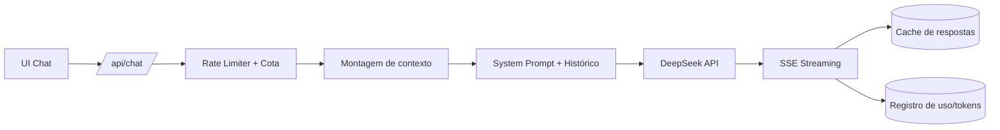

# 03 — Documento de Design de IA (AIDD)

**Projeto:** ConcursoAI Platform
**Versão:** 1.0
**Data:** 2026-08-04

---

## 1. Visão Geral

O **Professor IA** é o coração inteligente da plataforma. Ele é um tutor especializado em concursos públicos brasileiros que responde dúvidas, explica conteúdos, resolve questões e orienta o plano de estudos — tudo em pt-BR, com didática e alinhamento ao edital da banca do usuário.

## 2. Provedor e Modelos

| Modelo | Mapeamento | Uso | Custo relativo |
| --- | --- | --- | --- |
| **deepseek-chat** | `V4 Flash` | Respostas rápidas, chat geral, dúvidas simples | 1x |
| **deepseek-reasoner** | `V4 Pro` | Raciocínio profundo, questões complexas, redação/peças | ~5–10x |

- Endpoint: `https://api.deepseek.com/chat/completions` (compatível com OpenAI SDK).
- O usuário escolhe o modelo por mensagem ou por configuração padrão no perfil.
- O plano **Gratuito** usa apenas Flash; **Pro/Intensivo** libera o Pro (sujeito a cotas).

## 3. Arquitetura do Serviço de IA

## 4. Design de Prompt

### 4.1 System Prompt (núcleo)

Localizado em `prompts/professor-ia/system.md`. Princípios:

1. **Papel:** tutor brasileiro especialista em concursos públicos, didático e paciente.
2. **Contexto dinâmico:** disciplina, banca, cargo, nível do usuário, edital (quando houver).
3. **Formato:** markdown; respostas estruturadas (tópicos, bullets); exemplos práticos.
4. **Técnica:** método "Pergunte → Explique → Aplique → Questione" para fixação.
5. **Regras de conteúdo:** focar em legislação vigente (atualizada), jurisprudência sumulada (STF/STJ/TST), súmulas vinculantes; indicar quando informação pode mudar.
6. **Proibido:** inventar leis/súmulas; quando não souber, dizer que não sabe e sugerir a fonte oficial.

### 4.2 Templates por cenário (`prompts/`)

| Arquivo | Cenário |
| --- | --- |
| `professor-ia/system.md` | Prompt raiz do tutor |
| `professor-ia/questao.md` | Explicar/Resolver uma questão |
| `professor-ia/cronograma.md` | Gerar plano de estudos a partir de um edital |
| `professor-ia/resumo.md` | Resumir um tópico para revisão |
| `professor-ia/simulado.md` | Criar questão de múltipla escolha estilo banca |
| `professor-ia/redacao.md` | Correção e orientação de redação/peça |
| `flashcards/gerar.md` | Gerar flashcards a partir de um tópico |

## 5. Montagem de Contexto (Context Window Budget)

Cada requisição monta a seguinte estrutura (token budget alvo):

| Segmento | Tokens (aprox.) | Notas |
| --- | --- | --- |
| System prompt | 800–1.200 | Fixo + variáveis de contexto |
| Perfil do usuário | 200 | Nível, banca, cargo, concurso alvo |
| Contexto de conteúdo | 500–2.000 | Resumo do tópico atual / trecho do edital (futuro: RAG) |
| Histórico recente | 3.000–6.000 | Últimas N mensagens (janela deslizante) |
| Mensagem atual | — | Entrada do usuário |
| **Total alvo** | **≤ 8.000** | Flash; Pro pode usar janela maior |

- Janela deslizante: mantém últimas 10 mensagens (ou ~6k tokens), truncando as mais antigas.
- O conteúdo da Knowledge Engine (pós-MVP) entra via **RAG** (top-k chunks) — ver `07-RAG.md`.

## 6. Parâmetros de Geração

| Parâmetro | Flash (chat) | Pro (reasoner) |
| --- | --- | --- |
| `temperature` | 0.5 (fatos) / 0.7 (didática) | 0.3 |
| `max_tokens` | 2.048 | 4.096 |
| `stream` | true | true |
| `top_p` | 0.9 | 0.8 |

> Nota: `deepseek-reasoner` produz raciocínio interno (`reasoning_content`); na UI exibimos um indicador "pensando..." e depois a resposta final.

## 7. Streaming (SSE)

- O cliente envia `POST /api/chat` com `stream: true`.
- O servidor conecta na DeepSeek com `stream: true` e encaminha os deltas via `text/event-stream`.
- Eventos: `start`, `delta` (conteúdo), `reasoning` (quando Pro), `done` (com uso de tokens), `error`.
- Timeout total por request: 120 s. Reconnect com ID de evento para robustez.

## 8. Segurança e Moderação

- **Rate limit:** por usuário/plano (ex.: Gratuito 50 msgs/dia, Pro 500/dia).
- **Cota de tokens:** janela móvel diária; retorna `429` com mensagem amigável.
- **Sanitização:** escapar HTML nas mensagens antes de renderizar; usar `react-markdown`.
- **Guardrails de conteúdo:** bloquear instruções nocivas; recusar educadamente conteúdo ilegal/proibido.
- **Privacidade:** não enviar dados de outros usuários ao contexto; PII minimizada.

## 9. Avaliação de Qualidade (Evals)

| Métrica | Como medir | Alvo |
| --- | --- | --- |
| Precisão fática | Revisão de amostra por especialista | ≥ 90% sem alucinação relevante |
| Utilidade | Feedback thumbs up/down do usuário | ≥ 80% positivos |
| Latência | p95 do primeiro token | < 3 s |
| Custo | $/resposta | Flash < $0.01; Pro < $0.05 |

## 10. Melhorias Futuras

- **RAG no chat:** injetar chunks relevantes da Knowledge Engine (embeddings pgvector).
- **Memória de longo prazo:** perfil de erros do usuário para personalizar explicações.
- **Geração de questões:** produzir questões inéditas no estilo da banca alvo.
- **Modo prova oral / peças jurídicas** para carreiras específicas.
- **Avaliação automática de evolução** com prompts de diagnóstico.

## 11. Custos e Dimensionamento (estimativa)

- Preço de referência DeepSeek (chat/reasoner) por 1M tokens: entrada ~$0.14 / saída ~$0.28 (chat).
- 1 mensagem média ≈ 500 tokens de saída → Gratuito (50/dia) ≈ R$ 0,30/dia/mês por usuário ativo.
- Margem saudável para planos Pro/Intensivo; ajustar cotas conforme dados reais.
