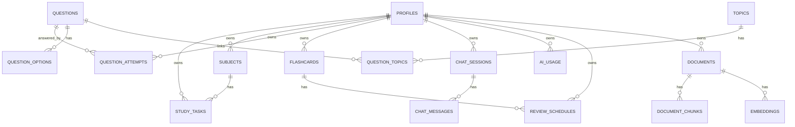

# 04 — Documento de Banco de Dados

**Projeto:** ConcursoAI Platform
**Versão:** 1.0
**Data:** 2026-08-04

---

## 1. Stack de Dados

- **PostgreSQL 15+** gerenciado pelo **Supabase**.
- **pgvector** (extensão) para embeddings — utilizado na Knowledge Engine (futuro).
- **RLS (Row Level Security)** habilitado em todas as tabelas (ver `policies.sql`).
- **Migrations** versionadas via SQL em `sql/` (e opcionalmente Drizzle).

## 2. Diagrama Entidade-Relacionamento (visão geral)

## 3. Tabelas (MVP)

### 3.1 `profiles`
Perfil estendido do usuário (1:1 com `auth.users` do Supabase).

| Coluna | Tipo | Descrição |
| --- | --- | --- |
| `id` | uuid PK | = `auth.users.id` |
| `full_name` | text | Nome completo |
| `email` | text | E-mail (cópia para consulta rápida) |
| `avatar_url` | text | URL do avatar |
| `plano` | text | `free` / `pro` / `intensivo` |
| `nivel` | text | `iniciante` / `intermediario` / `avancado` |
| `concurso_alvo` | text | Concurso alvo (ex.: "TCE-SP") |
| `banca_preferida` | text | Banca preferida (ex.: "FGV") |
| `meta_diaria_min` | int | Meta de minutos por dia |
| `modelo_ia_padrao` | text | `flash` / `pro` |
| `created_at` | timestamptz | Criação |
| `updated_at` | timestamptz | Atualização |

### 3.2 `subjects`
Disciplinas do usuário.

| Coluna | Tipo | Descrição |
| --- | --- | --- |
| `id` | uuid PK | |
| `user_id` | uuid FK → profiles | Dono |
| `name` | text | Nome da disciplina |
| `color` | text | Cor para UI |
| `priority` | smallint | 1–5 (5 = máxima) |
| `carga_horaria_total` | int | Minutos planejados |
| `created_at` | timestamptz | |

### 3.3 `study_tasks`
Tarefas do cronograma.

| Coluna | Tipo | Descrição |
| --- | --- | --- |
| `id` | uuid PK | |
| `user_id` | uuid FK → profiles | |
| `subject_id` | uuid FK → subjects | Disciplina |
| `title` | text | Título da tarefa |
| `description` | text | Detalhes |
| `scheduled_date` | date | Data agendada |
| `duration_min` | int | Duração estimada |
| `status` | text | `pendente` / `concluida` / `adiada` |
| `completed_at` | timestamptz | Quando concluída |
| `created_at` | timestamptz | |

### 3.4 `questions`
Banco de questões (curadoria + geradas).

| Coluna | Tipo | Descrição |
| --- | --- | --- |
| `id` | uuid PK | |
| `subject_id` | uuid FK → subjects (global de conteúdo) | Matéria |
| `banca` | text | Banca |
| `cargo` | text | Cargo |
| `ano` | int | Ano |
| `nivel` | text | `facil` / `medio` / `dificil` |
| `enunciado` | text | Enunciado |
| `gabarito` | char(1) | Letra correta (A–E) |
| `explicacao` | text | Comentário do gabarito |
| `tipo` | text | `multipla_escolha` |
| `fonte` | text | Origem (site oficial, IA, curadoria) |
| `is_public` | boolean | Visível a todos |
| `created_at` | timestamptz | |

> Nota: no MVP há tabelas de conteúdo globais (`subjects`, `questions`) e tabelas por usuário. O `subject_id` em `questions` referencia a tabela global `subjects` de conteúdo; os usuários têm suas próprias `subjects` para o cronograma. **Simplificação**: usamos `subject_id` como UUID livre — recomendamos uma tabela `content_subjects` no futuro.

### 3.5 `question_options`
Alternativas das questões.

| Coluna | Tipo | Descrição |
| --- | --- | --- |
| `id` | uuid PK | |
| `question_id` | uuid FK → questions | |
| `letter` | char(1) | A–E |
| `text` | text | Texto da alternativa |
| `is_correct` | boolean | Se é o gabarito |

### 3.6 `question_attempts`
Histórico de tentativas do usuário.

| Coluna | Tipo | Descrição |
| --- | --- | --- |
| `id` | uuid PK | |
| `user_id` | uuid FK → profiles | |
| `question_id` | uuid FK → questions | |
| `selected_letter` | char(1) | Resposta escolhida |
| `is_correct` | boolean | Acertou? |
| `time_spent_sec` | int | Tempo gasto |
| `mode` | text | `estudo` / `simulado` / `revisao` |
| `created_at` | timestamptz | |

### 3.7 `flashcards`

| Coluna | Tipo | Descrição |
| --- | --- | --- |
| `id` | uuid PK | |
| `user_id` | uuid FK → profiles | |
| `subject_id` | uuid FK → subjects (do usuário) | |
| `front` | text | Frente (pergunta) |
| `back` | text | Verso (resposta) |
| `tags` | text[] | Etiquetas |
| `created_at` | timestamptz | |

### 3.8 `review_schedules`
Agendamento SRS (repetição espaçada) por flashcard.

| Coluna | Tipo | Descrição |
| --- | --- | --- |
| `id` | uuid PK | |
| `user_id` | uuid FK → profiles | |
| `flashcard_id` | uuid FK → flashcards | |
| `interval_days` | int | Intervalo atual em dias |
| `ease_factor` | real | Fator de facilidade (SM-2) |
| `repetitions` | int | Nº de repetições bem-sucedidas |
| `due_date` | date | Próxima revisão |
| `last_reviewed_at` | timestamptz | Última revisão |
| `updated_at` | timestamptz | |

### 3.9 `chat_sessions`

| Coluna | Tipo | Descrição |
| --- | --- | --- |
| `id` | uuid PK | |
| `user_id` | uuid FK → profiles | |
| `title` | text | Título da conversa |
| `subject_id` | uuid FK → subjects (opcional) | Disciplina em contexto |
| `model` | text | `flash` / `pro` |
| `created_at` | timestamptz | |
| `updated_at` | timestamptz | |

### 3.10 `chat_messages`

| Coluna | Tipo | Descrição |
| --- | --- | --- |
| `id` | uuid PK | |
| `session_id` | uuid FK → chat_sessions | |
| `user_id` | uuid FK → profiles | |
| `role` | text | `user` / `assistant` / `system` |
| `content` | text | Conteúdo |
| `model` | text | Modelo usado (assistant) |
| `tokens_in` / `tokens_out` | int | Uso |
| `created_at` | timestamptz | |

### 3.11 `ai_usage`
Cotas de uso de IA por usuário.

| Coluna | Tipo | Descrição |
| --- | --- | --- |
| `id` | uuid PK | |
| `user_id` | uuid FK → profiles | |
| `usage_date` | date | Dia da janela |
| `messages_count` | int | Mensagens consumidas |
| `tokens_in` / `tokens_out` | bigint | Total de tokens |
| `updated_at` | timestamptz | |

### 3.12 `payments`
Histórico de pagamentos (Mercado Pago).

| Coluna | Tipo | Descrição |
| --- | --- | --- |
| `id` | uuid PK | |
| `user_id` | uuid FK → profiles | |
| `provider` | text | `mercadopago` |
| `provider_id` | text | ID do pagamento no Mercado Pago |
| `plan` | user_plan | Plano pago (`pro` / `intensivo`) |
| `amount_cents` | int | Valor em centavos |
| `status` | text | `approved` / `pending` / `rejected` / `cancelled` |
| `external_reference` | text | `"plano:userId"` |
| `paid_at` | timestamptz | Quando aprovado |
| `created_at` | timestamptz | |

> Gerenciada exclusivamente pela função `register_payment()` (SECURITY DEFINER),
> chamada pelo webhook — **sem** acesso direto do cliente.

## 4. Tabelas (Futuro — Knowledge Engine)

> Ver `06-KNOWLEDGE-ENGINE.md`, `07-RAG.md` e `08-ETL.md` para detalhes.

### `documents`
Arquivos importados (PDF, áudio, vídeo, leis).

| Coluna | Tipo | Descrição |
| --- | --- | --- |
| `id` | uuid PK | |
| `user_id` | uuid FK → profiles | |
| `type` | text | `pdf` / `audio` / `video` / `law` / `edital` |
| `title` | text | |
| `storage_path` | text | Caminho no R2/Supabase Storage |
| `status` | text | `pending` / `processing` / `done` / `error` |
| `file_size` | bigint | |
| `mime_type` | text | |
| `created_at` | timestamptz | |

### `document_chunks`
Chunks de texto extraídos (OCR/Whisper).

| Coluna | Tipo | Descrição |
| --- | --- | --- |
| `id` | uuid PK | |
| `document_id` | uuid FK → documents | |
| `seq` | int | Ordem no documento |
| `content` | text | Texto do chunk |
| `metadata` | jsonb | Página, timestamp, seção |
| `created_at` | timestamptz | |

### `embeddings`
Vetores por chunk (pgvector).

| Coluna | Tipo | Descrição |
| --- | --- | --- |
| `id` | uuid PK | |
| `chunk_id` | uuid FK → document_chunks | |
| `model` | text | Modelo de embedding |
| `embedding` | vector(1536) | Vetor (1536-d OpenAI; ou 768 se outro) |
| `created_at` | timestamptz | |

## 5. Índices

Ver `sql/indexes.sql`. Resumo:

- `study_tasks(user_id, scheduled_date)`
- `question_attempts(user_id, created_at DESC)`
- `question_attempts(question_id)`
- `flashcards(user_id)`
- `review_schedules(user_id, due_date)`
- `chat_messages(session_id, created_at)`
- `ai_usage(user_id, usage_date)`
- `embeddings` com índice **HNSW** (`vector_cosine_ops`)
- `document_chunks(document_id, seq)`

## 6. Políticas de Segurança (RLS)

Ver `sql/policies.sql`. Princípios:

- Toda tabela com `user_id` tem política `FOR SELECT/USING (auth.uid() = user_id)`.
- Tabelas públicas (`questions` com `is_public = true`) têm `SELECT` para todos autenticados.
- Writes exigem `WITH CHECK (auth.uid() = user_id)`.
- `ai_usage` é gerenciado exclusivamente por função de servidor (service role) — **sem** acesso direto do cliente.
- Função `get_user_plan()` em SQL para aplicar cotas no servidor.

## 7. Migrações e Versionamento

- `sql/schema.sql` — DDL completo (tabelas + extensão pgvector + enums).
- `sql/indexes.sql` — índices e índices vetoriais.
- `sql/policies.sql` — RLS e políticas.
- `sql/seed.sql` — dados de demonstração.
- Ordem de aplicação: **schema → indexes → policies → seed**.
- Com Supabase CLI: `supabase db push` (ou SQL Editor).
