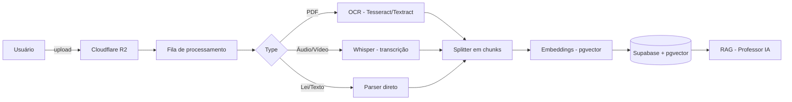

# 06 — Knowledge Engine (Engine de Conhecimento)

**Projeto:** ConcursoAI Platform
**Status:** PÓS-MVP (design)
**Data:** 2026-08-04

---

## 1. Objetivo

Transformar **documentos de estudo** (PDFs, apostilas, editais, vídeos, áudios de aulas e legislação) em **conhecimento estruturado e pesquisável**, alimentando o Professor IA com contexto via **RAG (Retrieval-Augmented Generation)**.

## 2. Fluxo de Ingestão (Pipeline)



## 3. Fontes de Conhecimento

| Fonte | Formato | Pipeline |
| --- | --- | --- |
| Apostilas/PDFs | PDF | Extração de texto → OCR quando necessário |
| Editais | PDF/HTML | Parser especializado → metadados (cargo, banca, datas) |
| Legislação | Texto/Lei seca | Download + parse de artigos (ex.: CF/88, CLT, CP) |
| Videoaulas | MP4/MP3 | Whisper (transcrição) → diarização opcional |
| Anotações | MD/TXT | Ingestão direta |

## 4. Componentes

### 4.1 Armazenamento de Arquivos
- **Cloudflare R2** (S3-compatível) para objetos grandes (PDF, vídeo, áudio).
- Buckets: `documents/`, `transcripts/`, `thumbnails/`.
- URLs presignadas para upload/download.
- Fallback: Supabase Storage no MVP.

### 4.2 Extração de Texto
- **PDF com texto nativo:** `pdf-parse` (rápido).
- **PDF escaneado (OCR):** Tesseract.js (pt-por) ou Textract da AWS para alta precisão.
- **Áudio/Vídeo:** Whisper (openai-whisper local ou API) com `language="pt"`, `task="transcribe"`.
- **Leis:** parsers com reconhecimento de estrutura (artigos, parágrafos, incisos).

### 4.3 Chunking (Divisão em trechos)
Estratégia híbrida:

1. **Semântico:** dividir por seções/artigos quando a estrutura existir (PDFs de leis).
2. **Por tamanho:** janela de 512–1.024 tokens com overlap de 10–15% para textos corridos.
3. **Por parágrafo:** manter coerência de parágrafos para apostilas.

### 4.4 Embeddings
- Modelo: `text-embedding-3-small` (OpenAI, 1536-d) ou modelo de embedding do Supabase (`gte-small`).
- Dimensão configurável; coluna `vector(1536)`.
- Batch de 100 chunks por chamada.

### 4.5 Indexação Vetorial (pgvector)
- Tabela `embeddings` com índice **HNSW** (`vector_cosine_ops`).
- Query de similaridade: `ORDER BY embedding <=> $query LIMIT k`.

## 5. Metadados Enriquecidos

Cada chunk carrega `metadata` (jsonb):

```json
{
  "document_id": "uuid",
  "page": 42,
  "section": "Direito Administrativo",
  "article": "Art. 37",
  "law": "CF/88",
  "timestamp_start": 0,
  "timestamp_end": 34.2,
  "user_id": "uuid",
  "access": "private" | "public"
}
```

## 6. Processamento Assíncrono

- **Fila:** Postgres-based queue (pgmq) ou BullMQ + Redis.
- **Estados:** `pending → processing → done | error`.
- **Jobs:**
  1. `extract` — texto bruto
  2. `chunk` — dividir
  3. `embed` — gerar vetores
  4. `index` — persistir no pgvector
- **Retry:** até 3 tentativas com backoff exponencial.
- **Progresso:** atualiza `documents.status` e percentual para a UI.

## 7. APIs da Knowledge Engine

| Método | Rota | Descrição |
| --- | --- | --- |
| POST | `/api/knowledge/documents` | Upload (multipart → R2) |
| GET | `/api/knowledge/documents` | Lista documentos |
| GET | `/api/knowledge/documents/[id]` | Status + metadados |
| DELETE | `/api/knowledge/documents/[id]` | Remove (R2 + vetores) |
| POST | `/api/knowledge/documents/[id]/reprocess` | Re-processa |
| GET | `/api/knowledge/search?q=...` | Busca semântica nos documentos do usuário |

## 8. Integração com o Professor IA (RAG)

Ver `07-RAG.md`. Resumo:
- Quando o usuário pergunta, o servidor faz busca vetorial no pgvector.
- Os top-k chunks são injetados no prompt do Professor IA como contexto.
- A resposta cita a fonte (`[Apostila X, pág. 42]`).

## 9. Privacidade e Compartilhamento

- Por padrão, documentos são **privados** (`access = private`).
- Opção de publicar para a comunidade (curadoria, futura).
- Vetores e chunks herdam `user_id` → protegidos por RLS.

## 10. Métricas de Sucesso

| Métrica | Alvo |
| --- | --- |
| Tempo de ingestão de PDF de 100 páginas | < 2 min |
| Precisão do OCR (pt-BR) | ≥ 95% |
| Precisão da transcrição Whisper | ≥ 90% (WER ≤ 10%) |
| Relevância top-5 do RAG | ≥ 80% |
| Custo por documento (médio) | < R$ 0,50 |
