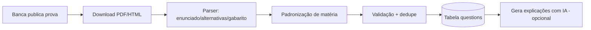

# 08 — ETL (Extract, Transform, Load)

**Projeto:** ConcursoAI Platform
**Status:** PÓS-MVP (design)
**Data:** 2026-08-04

---

## 1. Objetivo

Coletar, limpar, padronizar e carregar **dados de conteúdo** na plataforma:

- **Questões** de concursos (curadoria e automação).
- **Editais** e seus metadados (cargos, vagas, conteúdos programáticos, datas).
- **Legislação** (leis, decretos, súmulas).
- **Calendário** de concursos (datas de inscrição e provas).

## 2. Fontes de Dados

| Fonte | Dados | Acesso |
| --- | --- | --- |
| Sites oficiais (bancas: Cespe/Cebraspe, FGV, Vunesp, FCC) | Provas, gabaritos, editais | Crawling / arquivos oficiais |
| Portal da Transparência / Diário Oficial | Legislação, editais | APIs abertas / scraping |
| Comunidades (PCI Concursos, Gran, Estratégia) | Calendário, estatísticas | APIs / crawling (respeitar ToS) |
| Curadoria manual | Questões revisadas | Painel admin |
| Usuários | Upload de documentos | Knowledge Engine |

## 3. Pipelines

### 3.1 Pipeline de Questões



- **Extração:** parser por banca (estruturas diferentes). Fallback: OCR.
- **Transform:** normalizar texto (remoção de OCR erros, unificação de símbolos), mapear matéria → `subject_id`.
- **Validação:** enunciado não vazio, 4–5 alternativas, gabarito presente.
- **Dedupe:** hash do enunciado normalizado (`md5` de texto limpo) + índice único.

### 3.2 Pipeline de Editais

- **Coleta:** monitorar páginas de bancas (agendado diário).
- **Extração:** seções — cargo, requisitos, vagas, conteúdo programático, cronograma.
- **Transform:** estrutura em JSON (`edital_metadata`).
- **Carregamento:** tabela `editais` (futura) + geração de cronograma sugerido.

### 3.3 Pipeline de Legislação

- **Coleta:** downloads de fontes oficiais (Planalto, STF/STJ/TST).
- **Transform:** parser de estrutura legal (artigos, parágrafos, incisos, alíneas) → JSON.
- **Carregamento:** tabela `laws`/`articles` com busca textual + vetorial (RAG).

## 4. Agendamento e Orquestração

- **Trigger:** cron (GitHub Actions / Vercel Cron / `pg_cron`).
- **Frequência:**
  - Questões de bancas: diário durante época de provas.
  - Editais: a cada 4h.
  - Legislação: diário (verificar atualizações).
- **Orquestração:** scripts Node em `scripts/etl/` com logging estruturado e idempotência.

## 5. Qualidade de Dados

| Etapa | Checagem | Ação |
| --- | --- | --- |
| Ingestão | Duplicação | Upsert por hash único |
| Padronização | Matéria/tema válido | Mapa de sinônimos (ex.: "Dir. Constitucional" = "Constitucional") |
| Gabarito | Letra ∈ {A–E} | Rejeitar questão e logar |
| Enunciado | ≥ 20 caracteres | Rejeitar |
| Banca | Lista conhecida | Marcar como `unknown` p/ curadoria |

## 6. Processamento de Documentos do Usuário (Knowledge Engine)

Ver `06-KNOWLEDGE-ENGINE.md`. Resumo do pipeline:

```
Upload → Storage(R2) → Fila → [Extract (OCR/Whisper)] → [Chunk] → [Embed] → pgvector
```

## 7. Configuração e Segredos

- Segredos (chaves de API, credenciais) em `Vault`/envs privadas.
- Crawlers com **rate limiting** e respeito ao `robots.txt` e termos de uso.
- Sem armazenar dados pessoais de terceiros além do necessário.

## 8. Monitoramento

- Métricas por pipeline: tempo, volume, taxa de erro, taxa de rejeição.
- Alertas se taxa de sucesso < 95%.
- Dashboard de dados (qualidade das fontes) em `16-ANALYTICS.md`.

## 9. Plano de Implementação (Fases)

| Fase | Entrega |
| --- | --- |
| 1 | Pipeline de questões para 3 bancas principais (Cebraspe, FGV, Vunesp) |
| 2 | Pipeline de legislação (CF/88, CLT, CP + súmulas) |
| 3 | Pipeline de editais e calendário |
| 4 | Integração com RAG e Professor IA |
