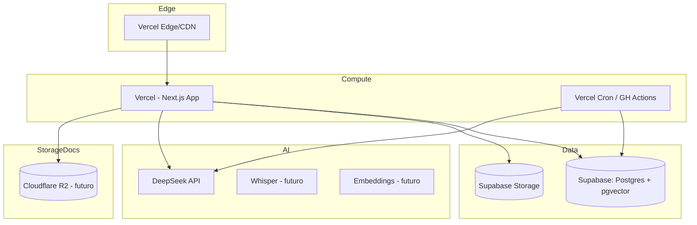

# 09 — Infraestrutura

**Projeto:** ConcursoAI Platform
**Versão:** 1.0
**Data:** 2026-08-04

---

## 1. Visão Geral

## 2. Serviços

| Serviço | Papel | Plano de referência |
| --- | --- | --- |
| **Vercel** | Hosting do app Next.js, edge, previews | Pro (autoscaling) |
| **Supabase** | Postgres + pgvector, Auth, Storage, Realtime | Pro ($25/mês) |
| **DeepSeek API** | LLM (chat/reasoner) | Pay-per-token |
| **Cloudflare R2** | Armazenamento de documentos (futuro) | Gratuito até 10 GB egress |
| **GitHub** | Repositório, CI/CD, Actions | Gratuito |
| **Upstash (futuro)** | Redis — rate limit, cache | Pay-per-use |

## 3. Ambientes

| Ambiente | URL | Banco | Propósito |
| --- | --- | --- | --- |
| Local | `localhost:3000` | Supabase local ou dev | Desenvolvimento |
| Staging | `staging.concursoai.app.br` | Supabase staging | Pré-produção, testes |
| Produção | `concursoai.app.br` | Supabase prod | Usuários |

- Previews de PR no Vercel apontam para o banco de staging.
- Migrações aplicadas em ordem: staging → produção, com backup automático do Supabase.

## 4. Variáveis de Ambiente por Ambiente

| Variável | Local | Staging | Prod |
| --- | --- | --- | --- |
| `NEXT_PUBLIC_SUPABASE_URL` | dev | staging | prod |
| `NEXT_PUBLIC_SUPABASE_ANON_KEY` | dev | staging | prod |
| `SUPABASE_SERVICE_ROLE_KEY` | dev | staging | prod |
| `DEEPSEEK_API_KEY` | dev | staging | prod |
| `AUTH_SECRET` | dev | staging | prod |
| `DATABASE_URL` | dev | staging | prod |

> `NEXT_PUBLIC_*` são públicas (seguras para anon key). Demais são privadas (servidor).

## 5. Banco de Dados

- **Postgres 15+** com extensões: `pgvector`, `pgcrypto`, `pg_trgm` (busca), `pg_stat_statements`.
- **Backups:** automáticos diários (retention 7 dias) + ponto de restauração.
- **Conections pooler:** PgBouncer (Supabase pooler) para serverless.
- **Índices** em `sql/indexes.sql` (inclui HNSW para vetores).

## 6. Escalabilidade

| Componente | Estratégia |
| --- | --- |
| App (Next.js) | RSC/SSR na edge; cache ISR para landing; stateless (escala horizontal) |
| Postgres | Pooler PgBouncer; índices; leituras em cache (Redis futuro) |
| IA | Rate limit + cotas; fila para processamento pesado (Knowledge Engine) |
| Storage | R2 com CDN; presigned URLs |
| Filas | PGMQ/BullMQ (futuro) para jobs de ETL e ingestão |

## 7. Observabilidade

| Ferramenta | Uso |
| --- | --- |
| Vercel Analytics + Speed Insights | Core Web Vitals, tráfego |
| Sentry | Error tracking (front e server) |
| Supabase Dashboard | DB metrics, queries lentas |
| Custom logs | Logs estruturados JSON no servidor |

## 8. CI/CD

- **GitHub Actions:**
  - `lint + typecheck + test` em todo push/PR.
  - `build` em PRs (verificação).
  - Deploy automático no Vercel (produção ao merge na `main`; preview por PR).
- **Migrations:** job separado aplicando `sql/` no staging e prod com rollback planejado.

## 9. Configuração Recomendada de Segredos

- Nunca no repositório (ver `.env.example` + `.gitignore`).
- No Vercel: Environment Variables por ambiente.
- Rotação de chaves a cada 90 dias (DeepSeek, service role).

## 10. Planos de Recuperação (DR)

- **Falha de banco:** restaurar do backup do Supabase (RPO ≤ 24h; RTO ≤ 1h).
- **Falha da Vercel:** redeploy da última imagem estável; fallback manual.
- **Falha da DeepSeek:** fallback para modelo alternativo ou mensagem de indisponibilidade.

## 11. Custos Estimados (Mensal, escala inicial)

| Item | Custo |
| --- | --- |
| Vercel Pro | $20 |
| Supabase Pro | $25 |
| DeepSeek (variável) | $30–100 |
| R2 | ~$0–5 |
| **Total** | **~$80–150** |

> Revisar conforme cresce: cache de respostas IA reduz custo significativamente.
