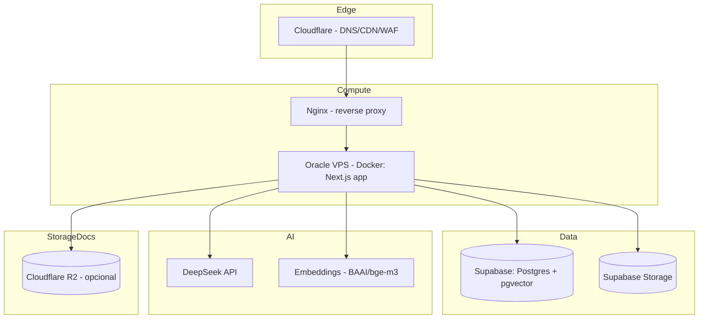

# 09 — Infraestrutura

**Projeto:** ConcursoAI Platform
**Versão:** 2.0
**Data:** 2026-08-23

---

## 1. Visão Geral

## 2. Serviços

| Serviço | Papel | Plano de referência |
| --- | --- | --- |
| **Oracle Cloud VPS** | Hosting do app Next.js (Docker Compose) | Always Free / PAYG |
| **Nginx** | Reverse proxy para `127.0.0.1:3001` | Open source |
| **Cloudflare** | DNS, CDN, WAF, HTTPS | Gratuito |
| **Supabase** | Postgres + pgvector, Auth, Storage | Pro ($25/mês) |
| **DeepSeek API** | LLM (chat/reasoner) | Pay-per-token |
| **Embeddings** | BAAI/bge-m3 (self-hosted ou API) | Opcional |
| **Cloudflare R2** | Armazenamento de documentos (opcional) | Gratuito até 10 GB egress |
| **GitHub** | Repositório, CI/CD, Actions | Gratuito |

## 3. Ambientes

| Ambiente | URL | Banco | Propósito |
| --- | --- | --- | --- |
| Local | `localhost:3000` | Supabase local ou dev | Desenvolvimento |
| Produção | `app.becotoy.com` | Supabase prod | Usuários |

- Deploy em produção via Docker no VPS (`infra/`).
- Migrações aplicadas em produção com backup automático do Supabase.

## 4. Variáveis de Ambiente por Ambiente

| Variável | Local | Prod |
| --- | --- | --- |
| `NEXT_PUBLIC_SUPABASE_URL` | dev | prod |
| `NEXT_PUBLIC_SUPABASE_ANON_KEY` | dev | prod |
| `SUPABASE_SERVICE_ROLE_KEY` | dev | prod |
| `DEEPSEEK_API_KEY` | dev | prod |
| `AUTH_SECRET` | dev | prod (obrigatório, ≥ 32 chars) |
| `DATABASE_URL` | dev | prod |
| `EMBEDDING_API_URL` | opcional | opcional (ativa RAG) |
| `R2_*` | opcional | opcional (storage S3) |

> `NEXT_PUBLIC_*` são públicas (seguras para anon key). Demais são privadas (servidor).

## 5. Banco de Dados

- **Postgres 15+** com extensões: `pgvector`, `pgcrypto`, `pg_trgm` (busca), `pg_stat_statements`.
- **Backups:** automáticos diários (retention 7 dias) + ponto de restauração.
- **Conections pooler:** PgBouncer (Supabase pooler) para o app.
- **Índices** em `sql/indexes.sql` (inclui HNSW para vetores).
- **RLS:** `database/<domain>/rls.sql` (inclui `embedding_cache` deny-by-default).

## Schema do Banco — Processo Oficial

1. **Fonte única:** `src/db/schema/` (arquivos Drizzle ORM).
2. **Gerar migração:** `npm run db:generate` (executa `drizzle-kit generate`).
3. **Verificar migrações:** `npm run db:check` (executa `drizzle-kit check`).
4. **Aplicar migração:** `npm run db:migrate` (executa `drizzle-kit migrate`).
5. **NUNCA** editar SQL manualmente em `database/migrations/`.
6. **NUNCA** editar arquivos em `drizzle/` manualmente.
7. SQL manual legado está em `database/legacy/` e serve apenas como referência histórica.
8. O baseline atual gerado pelo schema contém 40 tabelas; RLS, seeds, funções, views, triggers e extensões históricas precisam de revisão separada.

## 6. Escalabilidade

| Componente | Estratégia |
| --- | --- |
| App (Next.js) | RSC/SSR; cache ISR para landing; stateless (escala horizontal) |
| Postgres | Pooler PgBouncer; índices; leituras em cache (Redis futuro) |
| IA | Rate limit + cotas; fila para processamento pesado (Knowledge Engine) |
| Storage | R2 com CDN; presigned URLs |
| Filas | PGMQ/BullMQ (futuro) para jobs de ETL e ingestão |

## 7. Observabilidade

| Ferramenta | Uso |
| --- | --- |
| Logs do container | `docker compose logs` no VPS |
| Sentry | Error tracking (front e server) |
| Supabase Dashboard | DB metrics, queries lentas |
| Custom logs | Logs estruturados JSON no servidor |

## 8. CI/CD

- **GitHub Actions:**
  - `lint + typecheck + test` em todo push/PR.
  - `build` em PRs (verificação).
  - Deploy em produção via Docker no VPS (merge na `main` ou manual).
- **Migrations:** job separado aplicando as migrações geradas em `drizzle/` em prod com rollback planejado.

## 9. Configuração Recomendada de Segredos

- Nunca no repositório (ver `.env.example` + `.gitignore`).
- No servidor: `.env.production` (gitignored).
- Rotação de chaves a cada 90 dias (DeepSeek, service role, `AUTH_SECRET`).

## 10. Planos de Recuperação (DR)

- **Falha de banco:** restaurar do backup do Supabase (RPO ≤ 24h; RTO ≤ 1h).
- **Falha do VPS:** redeploy da última imagem estável; fallback manual.
- **Falha da DeepSeek:** fallback para modelo alternativo ou mensagem de indisponibilidade.

## 11. Custos Estimados (Mensal, escala inicial)

| Item | Custo |
| --- | --- |
| Vercel Pro | $20 |
| Supabase Pro | $25 |
| DeepSeek (variável) | $30–100 |
| R2 | ~$0–5 |
| **Total** | **~$80–150** |

> Revisar conforme cresce: cache de respostas IA reduz custo significativamente.
