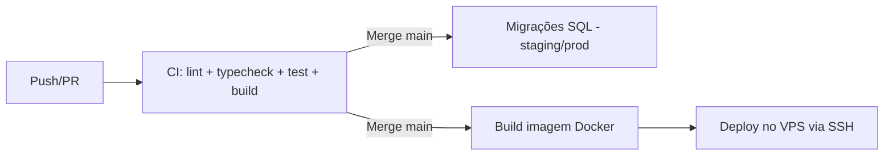

# 11 — Deploy

**Projeto:** ConcursoAI Platform
**Versão:** 2.0
**Data:** 2026-08-23

---

## 1. Estratégia de Deploy

- **Target:** Oracle Cloud VPS (Ubuntu) com Docker Compose + Nginx (reverse proxy) + Cloudflare (DNS/CDN).
- **Host:** `137.131.179.48` — app em `127.0.0.1:3001` (container), exposto via Nginx.
- **Domínio:** `https://app.becotoy.com`.
- **Estratégia:** build da imagem Docker no servidor (ou CI) → `docker compose up -d` → healthcheck.
- **Rollback:** reverter para a imagem/tag anterior no `docker-compose.yml` e `docker compose up -d`.

> **Nota:** o deploy NÃO é feito via Vercel. A infraestrutura real está em `infra/`
> (`Dockerfile`, `docker-compose.yml`, `nginx/`, `deploy.sh`, `healthcheck.sh`).

## 2. Pipeline CI/CD (GitHub Actions)



### Workflow `ci.yml`

| Etapa | Comando |
| --- | --- |
| Instalar | `npm ci` |
| Lint | `npm run lint` |
| Typecheck | `npm run typecheck` |
| Testes | `npm test` (Vitest) |
| Build | `npm run build` |

### Deploy (produção)

- Gatilho: push na `main` (ou manual via `infra/deploy.sh`).
- Passos:
  1. Rodar CI completo.
  2. Aplicar migrations geradas em `drizzle/` no banco de produção (com backup prévio).
  3. Build da imagem Docker (`infra/Dockerfile`, `output: "standalone"`).
  4. `docker compose up -d` no VPS.
  5. Healthcheck (`infra/healthcheck.sh`) valida a subida.

## 3. Migrações de Banco

- Arquivos históricos em `database/legacy/` e migrações oficiais em `drizzle/` (Drizzle ORM).
- Ordem: schema → indexes → RLS (`database/<domain>/rls.sql`) → seed (só dev/staging).
- **Regra de ouro:** migrações devem ser **reversíveis** e **não destrutivas** quando possível.
- Execução via `infra/migrate.sh` ou `docker compose -f infra/docker-compose.migrate.yml run migrate`.

## 4. Variáveis de Ambiente no Deploy

| Ambiente | Config |
| --- | --- |
| Produção | `.env.production` no servidor; `NEXT_PUBLIC_APP_URL=https://app.becotoy.com` |

> O `.env.production` é **gitignored** e deve ser copiado para o servidor. Nunca commitar segredos.

### Variáveis obrigatórias em produção

- `AUTH_SECRET` (≥ 32 chars — o app **crasha** na startup se ausente/fraca).
- `NEXT_PUBLIC_SUPABASE_URL`, `NEXT_PUBLIC_SUPABASE_ANON_KEY`, `SUPABASE_SERVICE_ROLE_KEY`.
- `DATABASE_URL` / `DIRECT_URL` (Supabase Postgres).
- `ADMIN_EMAILS` (allowlist de admins).
- `DEEPSEEK_API_KEY` (Professor IA).

### Variáveis opcionais (ativam recursos)

- `EMBEDDING_API_URL` / `EMBEDDING_API_KEY` — ativam busca vetorial/RAG. Sem elas, o pipeline cai em fallback (status `chunked`, busca só FTS).
- `R2_*` — storage S3-compatível. Sem elas, usa Supabase Storage (bucket `documents`).
- `MERCADO_PAGO_*` — pagamentos/assinaturas.

## 5. Deploy Manual (Passo a Passo)

```bash
# 1. Pré-requisitos (local)
npm ci
npm run lint && npm run typecheck && npm run build

# 2. Copiar .env.production para o servidor (uma vez)
scp .env.production root@137.131.179.48:/opt/concursoai/.env.production

# 3. Deploy no servidor (via infra/deploy.sh)
./infra/deploy.sh
```

## 6. Supabase

- Projeto: `concursoai-prod` (PostgreSQL + Auth + Storage).
- Aplicar schema via `drizzle-kit` usando `npm run db:migrate`; `database/legacy/` é apenas referência histórica.
- Configurar Auth: site URL, redirect URLs, e-mail templates (pt-BR).
- Storage buckets: `avatars`, `documents` (privados).
- RLS: aplicar `database/<domain>/rls.sql` (inclui `embedding_cache` deny-by-default).

## 7. Domínio e DNS

- Domínio principal: `app.becotoy.com`.
- DNS: Cloudflare → `A` record para `137.131.179.48`.
- HTTPS: Cloudflare (proxy) + Nginx no VPS.
- Config Nginx: `infra/nginx/` (proxy para `127.0.0.1:3001`).

## 8. Monitoramento Pós-Deploy

| Checagem | Como |
| --- | --- |
| Saúde do app | `GET /api/health` + `infra/healthcheck.sh` |
| Erros | Logs do container (`docker compose logs`) |
| Banco | Supabase Dashboard (queries lentas, conexões) |
| IA | Logs de erros do chat + latência |
| Rate limit | Logs de 429 (anti-abuso) |

## 9. Rollback e Hotfix

- **Rollback:** reverter a tag da imagem no `docker-compose.yml` e `docker compose up -d`.
- **Hotfix:** branch `hotfix/x` → PR → merge; ou rebuild manual no servidor.
- Migração problemática: restaurar backup do Supabase (RPO ≤ 24h).

## 10. Runbook de Falhas Comuns

| Sintoma | Causa provável | Ação |
| --- | --- | --- |
| App não sobe (crash na startup) | `AUTH_SECRET` ausente/fraca em prod | Definir `AUTH_SECRET` forte no `.env.production` |
| Build falha por env | Env ausente | Adicionar env; rebuild |
| Erro de RLS "new row violates policy" | Política faltando | Revisar `rls.sql`; aplicar |
| Chat falha (429 DeepSeek) | Cota/limite | Checar chave, cotas; alertar |
| Busca vetorial indisponível | `EMBEDDING_API_URL` ausente | Configurar embeddings; reprocessar docs |
| Conexão DB esgotada | Pooler/direto | Usar pooler; otimizar queries |
| 429 em massa | Rate limit anti-abuso | Verificar IPs/usuários; ajustar limites |

## 11. Checklist de Deploy

- [ ] CI verde (lint, typecheck, test, build)
- [ ] Migrations aplicadas (prod) com backup
- [ ] Envs corretas no `.env.production` (incl. `AUTH_SECRET` forte)
- [ ] Headers/segurança ativos em prod (`poweredByHeader: false`)
- [ ] Health check passando
- [ ] Teste E2E do fluxo de login no ambiente de destino
- [ ] `robots.txt` e `sitemap.xml` acessíveis
