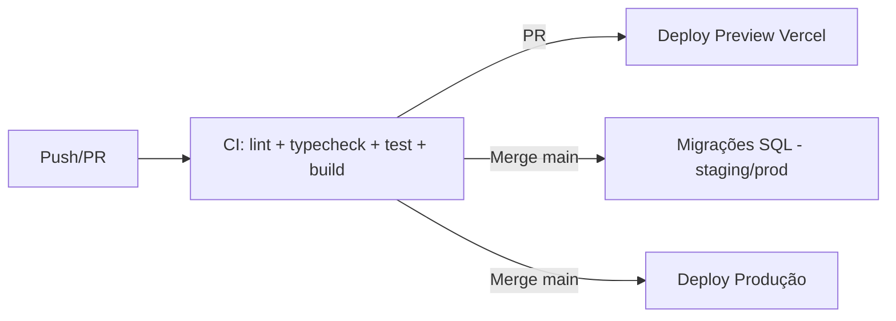

# 11 — Deploy

**Projeto:** ConcursoAI Platform
**Versão:** 1.0
**Data:** 2026-08-04

---

## 1. Estratégia de Deploy

- **Target:** Vercel (Plataforma oficial do Next.js).
- **Estratégia:** deploy automático por git — previews por PR, produção no merge da `main`.
- **Rollback:** redeploy de build anterior em 1 clique (Vercel).

## 2. Pipeline CI/CD (GitHub Actions)



### Workflow `ci.yml`

| Etapa | Comando |
| --- | --- |
| Instalar | `npm ci` |
| Lint | `npm run lint` |
| Typecheck | `npm run typecheck` |
| Testes | `npm test` (Vitest) |
| Build | `npm run build` |

### Workflow `deploy.yml`

- Gatilho: push na `main`.
- Passos:
  1. Rodar CI completo.
  2. Aplicar migrations (`sql/`) no banco de **staging** (job separado).
  3. Aguardar aprovação manual (opcional) para produção.
  4. Aplicar migrations no banco de **produção** (com backup prévio).
  5. `vercel --prod`.

## 3. Migrações de Banco

- Arquivos em `sql/` versionados (nomes numerados opcionais por PR).
- Ordem: `schema.sql → indexes.sql → policies.sql → seed.sql` (seed só em dev/staging, nunca em prod sem flag).
- **Regra de ouro:** migrações devem ser **reversíveis** (criar/drop reversos) e **não destrutivas** quando possível.
- Execução via Supabase CLI ou GitHub Action com service role.

## 4. Variáveis de Ambiente no Deploy

| Ambiente | Config |
| --- | --- |
| Preview (PR) | Usa staging DB; `NEXT_PUBLIC_APP_URL` = URL do preview |
| Staging | Staging DB; URL `staging.concursoai.app.br` |
| Produção | Prod DB; URL `concursoai.app.br` |

> Configurar no Vercel: Project → Settings → Environment Variables, com **separação por ambiente**.

## 5. Deploy Manual (Passo a Passo)

```bash
# 1. Pré-requisitos
npm ci
npm run lint && npm run typecheck && npm run build

# 2. Configurar ambiente na Vercel (primeira vez)
npx vercel link

# 3. Deploy preview
npx vercel

# 4. Deploy produção
npx vercel --prod
```

## 6. Supabase

- Criar projetos: `concursoai-dev`, `concursoai-staging`, `concursoai-prod`.
- Aplicar schema via SQL Editor ou `supabase db push`.
- Configurar Auth: site URL, redirect URLs, e-mail templates (pt-BR).
- Storage buckets: `avatars`, `documents` (privados).

## 7. Domínio e DNS

- Domínio principal: `concursoai.app.br`.
- DNS: apontar `A`/`CNAME` para Vercel.
- Custom domains em staging: `staging.concursoai.app.br`.
- HTTPS automático (Let's Encrypt via Vercel).

## 8. Monitoramento Pós-Deploy

| Checagem | Como |
| --- | --- |
| Saúde do app | Vercel status + `GET /api/health` |
| Erros | Sentry (release tagging) |
| Core Web Vitals | Vercel Speed Insights |
| Banco | Supabase Dashboard (queries lentas, conexões) |
| IA | Logs de erros do chat + latência |

## 9. Rollback e Hotfix

- **Rollback:** Vercel → Deployments → Promote anterior (Revert).
- **Hotfix:** branch `hotfix/x` → PR → merge; ou `vercel --prod` manual.
- Migração problemática: restaurar backup do Supabase (RPO ≤ 24h).

## 10. Runbook de Falhas Comuns

| Sintoma | Causa provável | Ação |
| --- | --- | --- |
| Build falha por env | Env ausente no Vercel | Adicionar env; redeploy |
| Erro de RLS "new row violates policy" | Política faltando | Revisar `policies.sql`; aplicar |
| Chat falha (429 DeepSeek) | Cota/limite | Checar chave, cotas; alertar |
| Landing 404 | Rota `(marketing)` | Checar route groups |
| Conexão DB esgotada | Pooler/direto | Usar pooler; otimizar queries |

## 11. Checklist de Deploy

- [ ] CI verde (lint, typecheck, test, build)
- [ ] Migrations aplicadas (staging e prod) com backup
- [ ] Envs corretas por ambiente
- [ ] Headers/segurança ativos em prod
- [ ] Health check passando
- [ ] Sentry com release tag
- [ ] Teste E2E do fluxo de login no ambiente de destino
