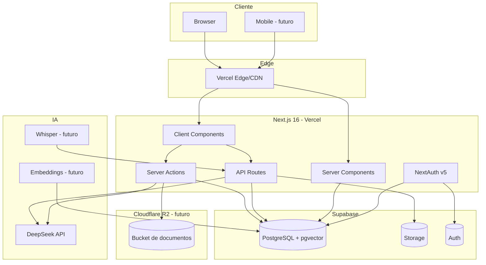
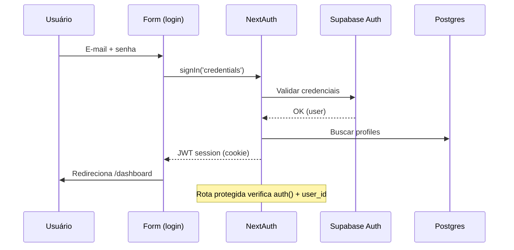
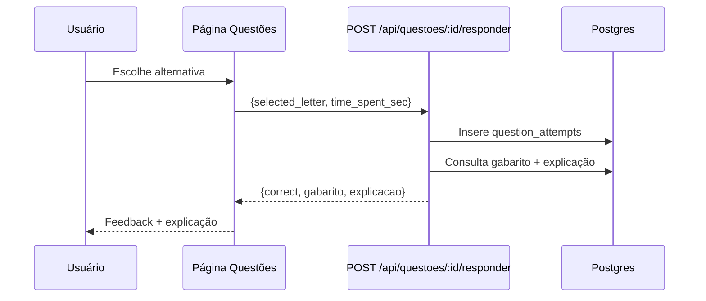
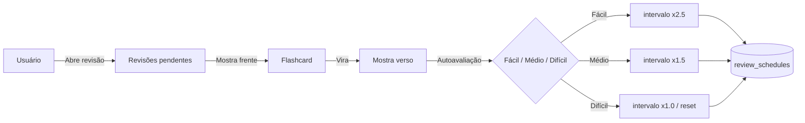
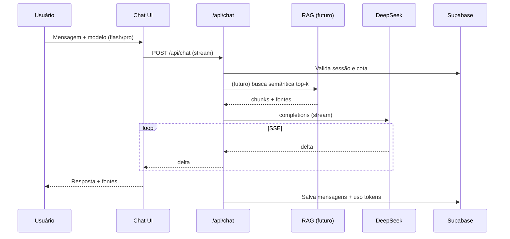
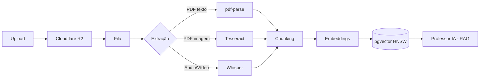
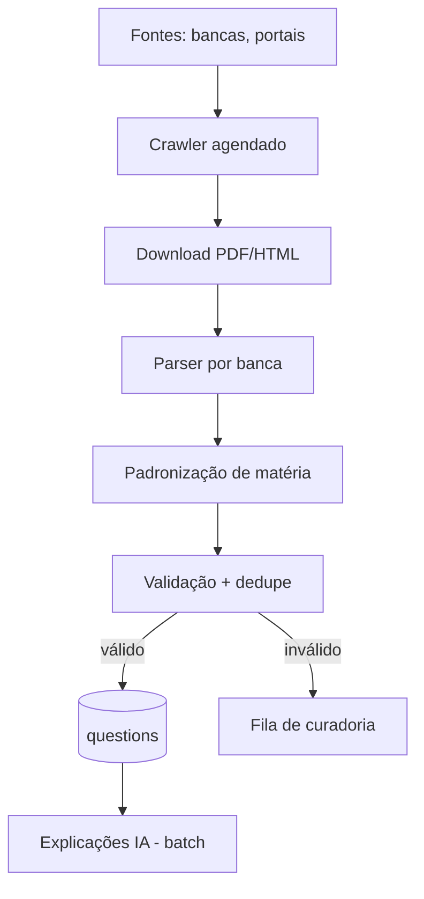
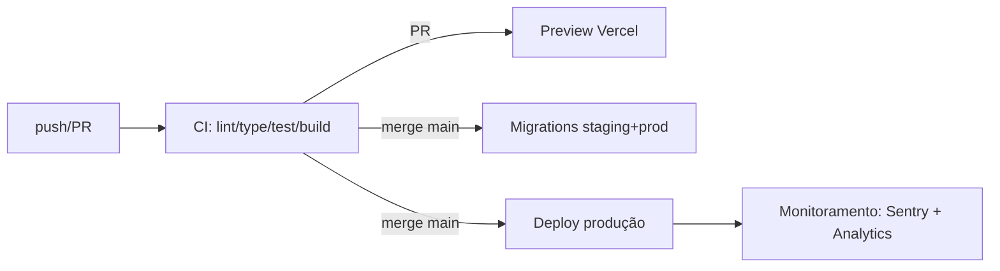
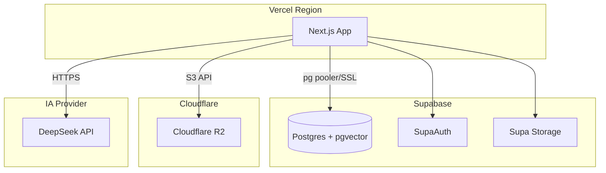

# 17 — Diagramas

**Projeto:** ConcursoAI Platform
**Data:** 2026-08-04

Este documento concentra todos os diagramas de arquitetura e fluxos da plataforma (formato Mermaid). Os diagramas também aparecem contextualizados nos documentos específicos (`02-SDD.md`, `06-KNOWLEDGE-ENGINE.md`, `07-RAG.md`, `08-ETL.md`, `11-DEPLOYMENT.md`).

---

## 1. Arquitetura Geral

## 2. Fluxo de Autenticação

## 3. Fluxo de Resolução de Questão

## 4. Fluxo de Revisão de Flashcards (SRS)

## 5. Fluxo do Chat com Professor IA (com RAG futuro)

## 6. Pipeline da Knowledge Engine

## 7. Pipeline ETL (Questões)

## 8. Fluxo de Deploy

## 9. Diagrama de Implantação (Deployment)

## 10. Legenda de Cores (sugestão para docs)

- **Verde:** fluxos do MVP.
- **Azul:** serviços externos.
- **Laranja:** módulos futuros (Knowledge Engine, RAG).
- **Vermelho tracejado:** dependências de segurança (RLS, cotas).
