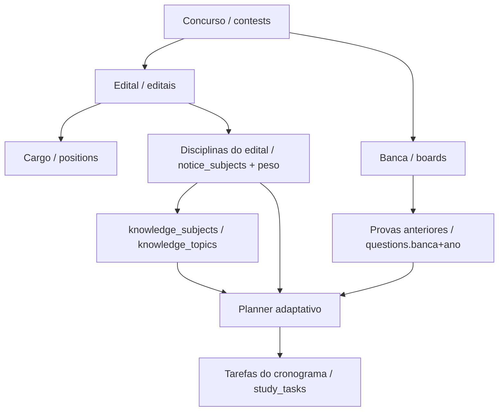

# 19 — Contest Intelligence Specification (Grupo D)

**Projeto:** ConcursoAI Platform
**Status:** Especificação — somente análise (sem código, sem SQL, sem migration)
**Data:** 2026-08-12
**Base:** `docs/12-CONTEST-DOMAIN-REVIEW.md` · `docs/04-DATABASE-LOGICAL.md` · `docs/08-DATABASE-PHYSICAL.md` · `docs/06-DOMAIN-DECISIONS.md`
**Checkpoint:** Grupo C (`d80d5bd`) fechado — esta spec prepara o **Grupo D+ (implementação futura)**.

---

## 1. Objetivo

Definir **como representar edital e peso de matéria** para a Contest Intelligence, de modo que:

1. O **planner adaptativo** (Grupos B + C) possa consumir os pesos do edital sem refazer o algoritmo.
2. A **migration** que vier depois **não precise ser refeita** (modelo à prova de mudanças).
3. A banca e as **provas anteriores** já usadas no Grupo C se encaixem no mesmo fluxo.

> **Decisão central em aberto:** edital e peso de matéria são o ponto que define o modelo — por isso esta spec existe antes de qualquer migration.

---

## 2. Fluxo de dados alvo



**Fontes de verdade:**
- **Concurso** agrega edital + banca (via `board`).
- **Edital** é a fonte oficial do conteúdo programático (disciplinas + pesos).
- **Cargo** pode ter pesos próprios (edital por cargo).
- **Banca** identifica o estilo das provas anteriores.
- **Planner** combina: desempenho (B) + banca (C) + peso do edital (D, futuro).

---

## 3. Estado atual (levantamento)

| Item | Onde | Estado |
| --- | --- | --- |
| `knowledge_subjects` + `knowledge_topics` (catálogo em árvore) | `src/db/schema/knowledge.ts` | ✅ Existe |
| `study_subjects` + `study_tasks` (disciplina/tarefa do usuário) | `src/db/schema/study.ts` | ✅ Existe (planner B/C) |
| `profiles.banca_preferida` / `concurso_alvo` | `src/db/schema/identity.ts` | ✅ Existe (usado no C) |
| `questions.banca` / `ano` / `cargo` | `src/db/schema/study.ts` | ✅ Existe (usado no C) |
| Fator banca no planner (`bancaScore` aditivo) | `adaptive-planner.service.ts` | ✅ Commitado (C) |
| `LinkResolverService` (study_subject ↔ knowledge_subject) | `src/lib/study/services/link-resolver.service.ts` | ✅ Existe |
| Domínio Contest (`contest.ts`) | `src/db/schema/contest.ts` | ⚠️ **Vazio** (`export {}`) |
| `organs` / `boards` / `contests` / `editais` | Docs físico (`08-DATABASE-PHYSICAL.md`) | ⚠️ Só documento, sem tabela |
| `database/contest/` (schema.sql/rls.sql) | `database/` | ⚠️ Não existe (outros domínios têm) |

**Gaps identificados:**
1. Não há tabela de `contests`, `editais`, `boards`, `organs`.
2. Não há representação relacional de **disciplina do edital com peso**.
3. Não há vínculo **cargo → disciplinas**.
4. `profiles.concurso_alvo` é texto livre (não referenciado a um contest).

---

## 4. Decisão central: como representar edital e peso de matéria

### Opções avaliadas

| Opção | Descrição | Prós | Contras |
| --- | --- | --- | --- |
| **A — JSON em `editais.programmatic_content`** | Guardar o conteúdo programático como JSON (já previsto no modelo físico) | Flexível; sem tabelas novas; import rápido | Não-relacional; JOIN difícil; peso não consultável pelo planner; normalização frágil |
| **B — `notice_subjects` relacional (recomendada)** | Tabela associativa `edital → knowledge_subject` com `weight` | Consultável; JOIN direto com o planner; pesos auditáveis; única fonte por (edital, cargo, matéria) | Mais tabelas; exige migration |
| **C — `position_subjects` (peso por cargo)** | Peso de matéria **por cargo** (edital por cargo) | Concurso multi-cargo correto | Multiplica linhas; só faz sentido se cargo for modelado |
| **D — `notice_topics` (peso por tópico)** | Granularidade fina no `knowledge_topics` | "Estudar exatamente o que o edital pede" | Árvore complexa; esforço alto; não é necessário na 1ª versão |

### Recomendação (híbrida)

> **B (relacional) como fonte de verdade + A (JSON) como armazenamento bruto de importação.**

- `editais.programmatic_content` (JSON) = **documento bruto** extraído/importado (fonte para ETL e auditoria).
- `notice_subjects` (tabela relacional) = **fonte estruturada** consumida pelo planner, com `weight`.
- `positions` (cargo) e `position_subjects` (peso por cargo) = **evolução natural** quando o concurso for multi-cargo; pode nascer já no modelo para não migrar duas vezes.
- `notice_topics` = **fase posterior** (granularidade fina), não bloqueia a 1ª versão.

**Por quê:** o planner precisa de **JOIN e agregação por matéria** (peso, share, normalização). JSON não permite isso de forma robusta. O domínio Contest já tem `editais.programmatic_content` no físico — ele continua existindo como bruto, e o `notice_subjects` é a camada estruturada derivada.

---

## 5. Modelo de dados proposto (futura migration)

> ⚠️ **Nada disso será criado nesta fase (Grupo D é só spec).** Definição para a implementação futura.

### 5.1 Tabelas (domínio Contest)

| Tabela | Colunas-chave | FK | Observação |
| --- | --- | --- | --- |
| `organs` | id, name(uniq), slug(uniq), description, status | — | Catálogo (leitura autenticado / escrita admin) |
| `boards` | id, name(uniq), slug(uniq), description, status | — | Banca (catálogo) |
| `contests` | id, organ_id, board_id, title, slug(uniq), status, start_date, end_date | organs, boards | Agregado raiz |
| `editais` | id, contest_id, title, version, published_date, content_url, `programmatic_content` (JSON bruto), status | contests | Um edital vigente por concurso (via status) |
| `positions` | id, contest_id, edital_id (opcional), name, slug, description | contests, editais | Cargo |
| `notice_subjects` | id, edital_id, position_id (NULL = vale p/ todo o concurso), knowledge_subject_id, `weight` (0..100 ou 0..1), status | editais, positions, knowledge_subjects | **Matéria do edital com peso** — unique (edital_id, position_id, knowledge_subject_id) |
| `notice_topics` *(fase 2)* | id, notice_subject_id, knowledge_topic_id, weight | notice_subjects, knowledge_topics | Granularidade fina |
| `exam_phases` / `exams` *(fase 2)* | id, contest_id / exam_phase_id, title, date | contests | Provas (vinculação de questões) |

### 5.2 Normalização do peso

- `weight` armazenado **bruto** (ex.: 0–100, soma ≠ 100 no banco).
- **Normalização no consumo** pelo planner: `share = weight / soma(pesos do mesmo escopo)`.
- Escopo do peso: `(edital_id, position_id)` — `position_id IS NULL` = peso geral; preenchido = peso do cargo (sobrescreve para aquele cargo).

### 5.3 Regras de negócio

- Um edital vigente por concurso (status = `publicado`).
- `notice_subjects` só referencia `knowledge_subjects` existentes (catálogo compartilhado — DD-001).
- Ao **vincular** a disciplina do usuário (`study_subjects`) ao `knowledge_subject`, o planner herda o peso do edital (mesmo `LinkResolverService` do Grupo B/C).
- Se não houver edital/`notice_subjects` para o usuário → fator neutro (comportamento do Grupo C preservado).

### 5.4 RLS

- Catálogo Contest (organs, boards, contests, editais, positions, notice_subjects): **leitura para autenticados; escrita para administrador** (mesmo padrão do físico).
- Nenhuma tabela Contest é do usuário (ao contrário de `study_subjects`).

### 5.5 Ingestão (ETL) — resumo

- **Manual/admin**: CRUD de edital + seleção de matérias com peso (UI admin).
- **IA assistida**: parse do PDF do edital → extração de disciplinas/tópicos → proposta de `notice_subjects` para revisão (Professor IA / pipeline).
- **Pipelines futuros**: pipelines de questões já previstos no backlog (#36–43) alimentam `questions.banca/ano` → base das "provas anteriores".

---

## 6. Impacto no planner (consumo futuro)

O `generateWeekPlan` (Grupo B/C) ganharia **um fator a mais**, sempre aditivo e neutro sem dados:

```
Grupo B:  acerto + volume + idle + tendência
Grupo C:  + bancaScore
Grupo D:  + editalWeight
```

- `editalWeight` por matéria = peso normalizado da `notice_subjects` do edital vigente do concurso alvo do usuário.
- Mesmo padrão do `bancaScore`: sem edital/`concurso_alvo` → fator neutro → **resultado idêntico ao Grupo C** (regressão por teste).
- O vínculo já existe (`study_subjects.name` → `knowledge_subjects.id` via `LinkResolverService`); o peso chega por essa chave.

**Escopo do usuário:** a partir de `profiles.concurso_alvo` (hoje texto livre) — na implementação D+, migrar para `profiles.contest_id` (FK) para o planner resolver o edital vigente. Decisão: manter `concurso_alvo` como fallback de texto até a UI de seleção de concurso existir.

---

## 7. Decisões em aberto (a resolver antes da migration)

| # | Decisão | Opções | Recomendação provisória |
| --- | --- | --- | --- |
| 1 | Peso por **edital** × **cargo** | Só edital · edital+cargo · só cargo | Modelar `position_id` NULL e preenchido (cobre ambos) |
| 2 | Escala do peso | 0–100 · 0–1 · share | Bruto 0–100, normalizar no consumo |
| 3 | Granularidade | matéria · matéria+tópico | Matéria na 1ª versão; tópico em fase 2 |
| 4 | Vínculo do usuário | `concurso_alvo` texto · `contest_id` FK · lista de editais seguidos | `contest_id` FK + fallback de texto |
| 5 | Origem dos dados | Admin manual · IA assistida · pipelines ETL | Híbrido: admin + IA assistida |
| 6 | Estratégia de migration | Drizzle `migrate` · SQL manual por domínio (`database/contest/schema.sql`) | **SQL manual** (padrão atual do projeto; evita o risco do `__drizzle_migrations` ausente) |

---

## 8. Riscos

- **Migration refeita**: mitigada pela decisão da seção 4 (relacional + JSON bruto + `position_id` flexível).
- **Conflito com `drizzle:migrate`**: tabelas Contest **não existem** → não haveria "already exists", mas o padrão seguro é SQL manual por domínio (como `database/study`, `database/knowledge`).
- **Peso sem fonte real**: sem ETL/admin, `notice_subjects` fica vazia → fator neutro (sem quebrar nada).
- **Multi-cargo**: adiar `position_subjects` só se o produto não tiver concurso multi-cargo na visão de 6 meses.

---

## 9. Próximos passos (fora desta fase)

1. Validar esta spec com stakeholders (decisões da seção 7).
2. **Fase 1 (D+):** schema Contest + `notice_subjects` + admin básico + fator `editalWeight` no planner (com regressão do Grupo C).
3. **Fase 2:** `positions`/`position_subjects`, `notice_topics`, `exam_phases`/`exams`, ingestão IA assistida.
4. **Fase 3:** ETL de editais e questões (backlog #36–43) + painel admin.

> **Checkpoint atual:** Grupo C `d80d5bd` permanece intacto. Nenhum código/banco foi alterado por esta especificação.
